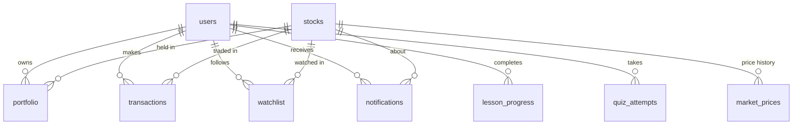

# StockMaster Backend

REST API + SQLite database for the StockMaster learning app.
Built with **Node.js, Express 5 and better-sqlite3** – no database server to install.

## Quick start

```bash
# 1. from the project root (StockMaster/)
npm run server:install          # installs the backend's packages (once)

# 2. configure
cp server/.env.example server/.env      # Windows: copy server\.env.example server\.env

# 3. run the backend  (creates + seeds the database on first start)
npm run server:dev              # auto-restarts on changes  (or: npm run server)

# 4. in a second terminal, run the React app
npm run dev
```

The API is at `http://localhost:4000/api`. The Vite dev server already proxies
`/api` to it, so React can simply call `fetch("/api/stocks")`.

Other commands (run inside `server/`):

| Command | What it does |
|---|---|
| `npm test` | Runs the 25 integration tests against a throw-away database |
| `npm run db:reset` | **Deletes** the database and recreates it with the 7 starter stocks |
| `npm run db:migrate` | Creates any missing tables (safe to re-run) |
| `npm run db:seed` | Adds the starter stocks if the stocks table is empty |

## Database tables

| Table | Purpose |
|---|---|
| `users` | Accounts: name, email, hashed password, virtual cash `balance` |
| `stocks` | The companies (same data as `src/data/stocks.js`): price, previous price, sector, P/E, dividend… |
| `market_prices` | Price history – one row per price change; feeds charts |
| `market_cache` | Key/value JSON cache with expiry for market calculations (overview) |
| `portfolio` | Current holdings – one row per (user, stock): quantity + average buy price |
| `transactions` | Immutable BUY/SELL history with price, total, realised profit/loss and balance after |
| `watchlist` | Stocks each user follows (the ⭐ button) |
| `notifications` | The 🔔 alerts: trade confirmations, price alerts on watched stocks, learning milestones |
| `lesson_progress` | Completed lessons per user (replaces the `localStorage` entry) |
| `quiz_attempts` | Quiz scores per user |



The full definition, with constraints and indexes, is in `src/db/schema.sql`.

### How the important rules are enforced

* **The server sets the price.** `POST /trade/buy` takes only `stockId` and `quantity`; the price is
  read from the database, so a client can't trade at a made-up price.
* **Trades are atomic.** Balance check → balance update → holding update → history row all happen in one
  database transaction. Fifty simultaneous buys can't overspend the balance (there's a test for this).
* **The database backs the rules up too:** `balance >= 0`, `quantity > 0`, `score <= total`, unique
  `(user, stock)` holdings, and `BUY`/`SELL` type checks.
* **Passwords** are hashed with bcrypt; login gives the same error for a wrong password and an unknown
  email. Sign-in is rate-limited.
* **Users are isolated** – every portfolio / transaction / watchlist / notification query is scoped to
  the logged-in user.

### Market simulation

Prices move every `MARKET_TICK_SECONDS` (default 60; `0` turns it off) by a random ±`MARKET_VOLATILITY_PCT`.
Each move is saved to `market_prices`, the market cache is cleared, and anyone watching a stock that moved
by at least `PRICE_ALERT_THRESHOLD_PCT` gets a notification. `POST /api/market/tick` triggers one move
on demand – useful for demos.

## API reference

Send the token from login/register as `Authorization: Bearer <token>`.
Errors look like `{ "error": { "code": "INSUFFICIENT_FUNDS", "message": "…", "details": … } }`.

| Method | Path | Auth | Description |
|---|---|:-:|---|
| GET | `/api/health` | – | Server status |
| POST | `/api/auth/register` | – | `{name, email, password}` → `{user, token}` |
| POST | `/api/auth/login` | – | `{email, password}` → `{user, token}` |
| GET | `/api/auth/me` | ✓ | Current user (with balance) |
| GET | `/api/stocks` | – | All stocks. Optional `?search=` and `?sector=` |
| GET | `/api/stocks/:idOrSymbol` | – | One stock, e.g. `/api/stocks/TCS` |
| GET | `/api/stocks/:idOrSymbol/history` | – | Price history, oldest first. `?limit=100` |
| GET | `/api/market/overview` | – | Rising/falling counts, top gainers/losers, sector averages (cached) |
| POST | `/api/market/tick` | ✓ | Move all prices once |
| GET | `/api/portfolio` | ✓ | `{balance, portfolio, holdings, summary}` |
| POST | `/api/portfolio/reset` | ✓ | Restore starting cash, clear holdings (history is kept) |
| POST | `/api/trade/buy` | ✓ | `{stockId, quantity}` |
| POST | `/api/trade/sell` | ✓ | `{stockId, quantity}` |
| GET | `/api/transactions` | ✓ | Trade history. `?type=BUY\|SELL&stockId=&limit=&offset=` |
| GET | `/api/watchlist` | ✓ | `{watchlist: [ids], stocks: [...]}` |
| POST | `/api/watchlist/:stockId/toggle` | ✓ | Add/remove (the ⭐ button) |
| DELETE | `/api/watchlist/:stockId` | ✓ | Remove |
| GET | `/api/notifications` | ✓ | `{unreadCount, notifications}`. `?unread=true&limit=` |
| POST | `/api/notifications/:id/read` | ✓ | Mark one as read |
| POST | `/api/notifications/read-all` | ✓ | Mark all as read |
| GET | `/api/learning/progress` | ✓ | `{completedLessons: [ids], quiz: {...}}` |
| POST | `/api/learning/lessons/:lessonId/complete` | ✓ | Mark a lesson done (idempotent) |
| POST | `/api/learning/quiz-attempts` | ✓ | `{moduleId?, score, total}` |
| GET | `/api/learning/quiz-attempts` | ✓ | Past attempts. `?moduleId=` |

The response shapes were designed to drop into your existing React state:

* stocks use the same field names as `src/data/stocks.js` (`id, symbol, name, sector, price, previousPrice,
  marketCap, pe, dividend, description`) plus `change` and `changePercent`;
* `portfolio` is `{ [stockId]: { quantity, averagePrice } }` – exactly what `App.jsx` keeps today;
* `watchlist` is an array of stock ids; `completedLessons` is an array of lesson ids.

## Connecting the React app

`src/services/api.js` wraps every endpoint. It stores the login token and turns server errors into
`ApiError`s whose `.message` you can show to the user. For example, in `App.jsx`:

```jsx
import { api } from "./services/api";

// load the market instead of using initialStocks
useEffect(() => {
  api.stocks.list().then(({ stocks }) => setStocks(stocks));
}, []);

// buy: the server validates funds, updates everything, and returns the new state
const buyStock = async (stock, quantity) => {
  try {
    const result = await api.trade.buy(stock.id, quantity);
    setBalance(result.balance);
    setPortfolio(result.portfolio);
    alert(`Bought ${quantity} shares of ${stock.symbol}`);
  } catch (err) {
    alert(err.message);          // e.g. "Insufficient virtual balance. You need ₹34,500 but have ₹20,000."
  }
};
```

The frontend still needs a login / sign-up screen so there is a token to send. Until then, the
public endpoints (`/stocks`, `/market/overview`) work without one.

## Going to production

* Set a real `JWT_SECRET` (the server refuses to start in production without one) and `NODE_ENV=production`.
* Set `CORS_ORIGIN` to your deployed frontend's URL, and `VITE_API_URL` when building the frontend.
* Serve over HTTPS. Back up `server/data/stockmaster.db`.
* Consider `ALLOW_MANUAL_TICK=false`.
* SQLite handles a class project or small deployment well. If you later need MySQL/PostgreSQL, the
  schema is plain SQL and all queries are in `src/services/` – that's the only layer to change.
